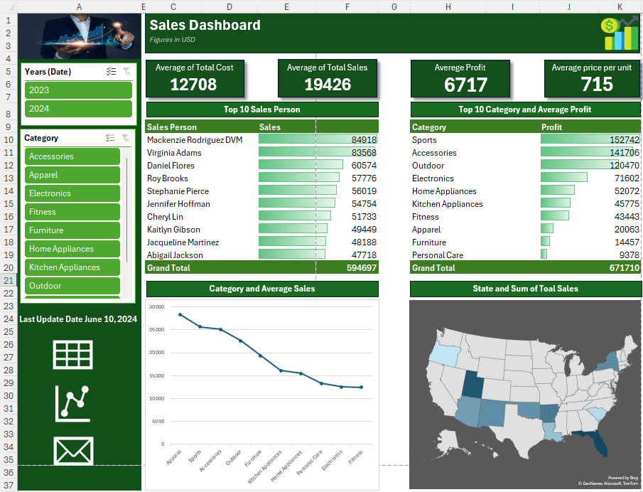

# VR Game Development and Sales Dashboard Analysis

## Project Overview

This repository contains my work on a VR Game Development and Sales Dashboard project. The primary goal was to analyze sales data and project budget for a virtual reality game development project. I used Microsoft Excel to perform data cleaning, analysis, and visualization, and developed key insights to inform business decisions. This work highlights my skills in data analysis, Excel, and dashboard creation.

## Key Files

- **Project Budget (Assign Part 1)**: Contains the planned budget for the VR game development project, including costs categorized by type.
- **Sales Data (Assign Part 2)**: Detailed data on sales, products, categories, pricing, and salesperson performance.
- **Pivot Table**: A summarized view of sales data, organized by year and category.
- **Sales Dashboard**: A visualization of the sales data with key metrics such as profit, total sales, and product categories.

## Sales Dashboard

Here is a visual snapshot of the sales dashboard created to analyze sales performance, profit margins, and product categories:

This dashboard highlights the following metrics:
- **Total Sales** across various product categories.
- **Profit Margins** for high-selling products.
- **Salesperson Performance** based on their contribution to total sales.

The dashboard allows for quick insights into sales trends, identifying top-performing products and regions, which could guide future marketing and sales efforts.

## Analysis Overview

### 1. **Sales Data Analysis**
   - **Sales Trends**: Analyzed trends in sales across different categories (e.g., electronics, sports, home appliances) to identify top-performing products and regions.
   - **Profitability**: Calculated profit margins for each product and identified high-profit items, providing insights into future marketing and sales strategies.
   - **Salesperson Performance**: Assessed the performance of individual salespeople based on total sales and profitability metrics.
   - **Customer Segmentation**: Examined customer data to identify key demographics contributing to the highest sales.

### 2. **Project Budget**
   - **One-Time Costs vs. Recurring Costs**: The budget data helped distinguish between one-time and recurring costs, which is important for future financial planning.
   - **Cost Control**: Focused on managing project costs by examining high-expense areas and opportunities for cost-saving.

### 3. **Pivot Table**
   - **Sales Summary**: Created a pivot table to summarize sales by year and category, which provided insights into annual performance and product success.

## Key Skills Demonstrated
- **Data Cleaning**: Cleaned and pre-processed raw sales and budget data to ensure accuracy in analysis.
- **Data Analysis**: Performed in-depth data analysis to extract meaningful insights related to sales, profitability, and customer demographics.
- **Excel Pivot Tables**: Leveraged pivot tables to quickly summarize and analyze large datasets.
- **Data Visualization**: Created an interactive dashboard to visualize sales data, making it easy to identify trends and outliers.

## Tools and Technologies
- **Microsoft Excel**: For data cleaning, analysis, and dashboard creation.
- **GitHub**: To manage the version control of the project and showcase the analysis.

## Insights & Conclusion
The analysis revealed several important findings:
- **Top-Selling Products**: Electronics and sports equipment generated the highest sales, indicating a strong market demand.
- **High-Profit Margins**: Certain products, like high-end electronics, had better profitability, which should be a focus for future sales efforts.
- **Sales Performance**: Salespersons like Mackenzie Rodriguez and Sean Brown were top performers, contributing significantly to total sales.

This project demonstrates my ability to work with real-world datasets and clean data, perform advanced analysis, and present results in a clear, actionable manner. These skills are critical for the Data Analyst role I am pursuing.

## How to Use This Repository
To explore the data and dashboards:
1. Download the repository and open the Excel files.
2. Review the **Sales Data** and **Budget** sheets for detailed information.
3. Explore the **Pivot Table** and **Dashboard** to interact with the summarized data.

## Contact Information
Feel free to contact me for more details:
- **LinkedIn**: [https://www.linkedin.com/in/prabeshrai/]
- **Email**: [raiprabesh775@gmail.com]
